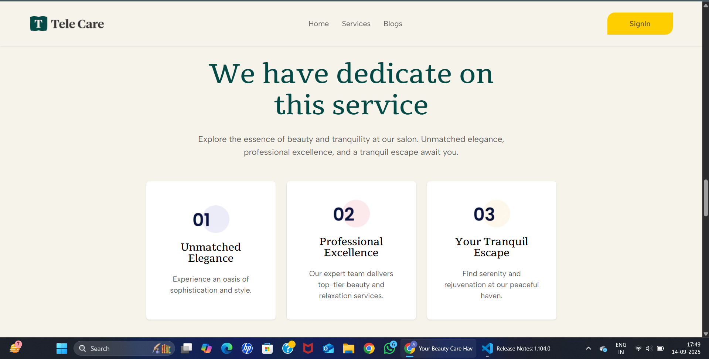

# 🎨 Tele care – Frontend Assignment  

## 📌 Description  
This project is developed as part of the **Frontend Developer Intern Assignment**.  
It simulates the booking flow of a makeup artist platform, allowing users to:  
- Browse services  
- Check availability  
- Proceed with booking  

The objective was to demonstrate **UI/UX design sense** and **frontend development skills** using **Next.js + TypeScript**.  

---

## ⚙️ Setup Steps to Run Locally  

1. **Clone the repository**  
   ```bash
   git clone https://github.com/Aditya-Walia1/Salon-Frontend.git
   cd Salon-Frontend
## ⚙️ Setup Steps to Run Locally  

2. **Install dependencies**  
   ```bash
   npm install
### 🚀 Run the Development Server  

3. **Start the server**  
   ```bash
   npm run dev


## 🎯 Design Choices

This section explains the UI/UX and technical design decisions made while building **Tele Care** to satisfy the assignment requirements and to keep the app scalable, maintainable and mobile-first.

### 1. High-level approach
- **Mobile-first, responsive design**  
  - Start styles for small screens and scale up for larger breakpoints. This ensures the app looks great on phones (primary evaluation target) and adapts to tablets/desktops.
  - Justification: assignment explicitly asks for mobile-first and responsiveness is part of evaluation.

- **Component-driven architecture (Atomic / Feature-based)**  
  - Break UI into reusable pieces: `Hero`, `CategoryCard`, `ArtistCard`, `BookingForm`, `Header`, `Footer`.  
  - Justification: improves reusability, testability, and readability — important for frontend best practices with Next.js + TypeScript.

### 2. Technology choices
- **Next.js + TypeScript**  
  - Next.js for routing, file-based pages and good developer DX; TypeScript for type-safety and fewer runtime bugs.
  - Justification: required by assignment and helps code quality.

- **Tailwind CSS**  
  - Utility-first styling for fast, responsive layouts and consistent spacing/typography.
  - Justification: makes mobile-first responsive styling concise and consistent; easy to customize theme tokens (colors, spacing).

- **Mock JSON data**  
  - `data/categories.json` and `data/artists.json` used for categories, subcategories and artist listings.  
  - Justification: no backend required; easy to extend and test.


### 🏠 Home Page (Landing Page)


The **Home Page** serves as the **entry point** to the platform.  
- It features a **Hero Section** with a welcoming headline, subheadline, and a clear **Call-to-Action (CTA)** (“Explore categories” and “My Bookings”).  
- The layout is **modern, minimal, and makeup-industry themed**, aligning with the assignment requirement of showcasing creativity in the landing page.  
- A simple **navbar** with links (Home, Services, Blogs) and a **Sign In button** provides intuitive navigation.  
- The design ensures clarity and engagement by immediately highlighting the platform’s purpose — booking top makeup artists for bridal, party, and editorial looks.  
- Mobile-first responsiveness ensures the layout adjusts gracefully on smaller screens.  

This fulfills the assignment requirement of a **Landing Page with Hero Section** that looks professional and industry-relevant.


### 💄 Services Page (Categories & Subcategories)


The **Services Page** displays the available categories and offerings in an engaging card-based layout.  
- Each service card includes an **image, name, price, duration, and rating placeholder**, making it easy for users to scan and compare services.  
- The design uses a **modern grid layout**, which is clean and responsive, ensuring a smooth browsing experience across devices.  
- This section satisfies the assignment requirement of **showcasing categories & subcategories creatively**, going beyond a simple text list.  
- By clicking on a service card, users can proceed to view more details and eventually book an artist.  

This justifies the requirement of a **Makeup Categories Section**, providing clarity, visual appeal, and interactivity for users.


### 📰 Blogs Page


The **Blogs Page** provides users with informative and engaging content related to beauty, makeup trends, and skincare.  
- Each blog is represented through a **visual card with an image**, making the layout visually appealing and easy to browse.  
- The section encourages users to explore **educational and inspirational content**, going beyond just services and bookings.  
- This page improves overall **user engagement and trust**, as blogs are a key part of beauty platforms to connect with customers.  
- The design remains **minimalist and mobile-friendly**, ensuring smooth readability across devices.  

While not mandatory in the assignment, this page adds **bonus value** by enhancing platform depth and aligning with industry practices.


### 🎨 Makeup Categories Section


The **Makeup Categories Section** is showcased directly on the Home Page, just below the hero banner.  
- Categories such as **Beauty Products, Eyebrow & Eyelash Services, Spa Services, Makeup Services, Skincare Services, and Hair Services** are represented using **visual icons and card-based layout**.  
- Each category card is **clickable**, leading the user toward the artist listing or services under that category.  
- The design is **interactive and creative**, going beyond a simple text list, thus satisfying the assignment requirement of presenting categories in an engaging way.  
- Icons and colors ensure the design is **visually appealing** and easily scannable, especially for mobile users.  
- This section guides users smoothly into exploring subcategories and artists, supporting the overall booking flow.  

This directly fulfills the **assignment’s Makeup Categories Section requirement**, making navigation simple and intuitive.


### 🌟 Featured Service Section (Home Page – Scroll Down)


As the user scrolls down the Home Page, a **Featured Service section** is displayed.  
- This section highlights a **specific offering (Rejuvenating Facial)** with an **illustration, short description, and call-to-action button (“See our services”)**.  
- It provides users with a quick preview of premium services while maintaining a **clean, modern layout**.  
- The design balances **text and imagery**, ensuring users understand the value proposition at a glance.  
- By emphasizing a single category/service, it creates a sense of focus and helps in **guiding users further into the booking flow**.  

This section demonstrates creativity in **presenting services beyond just grid layouts**, aligning with the assignment’s UI/UX expectations.


### 💅 Custom Beauty Makeovers (Home Page – Lower Section)


Scrolling further down the Home Page, the platform highlights **Custom Beauty Makeovers**.  
- This section introduces users to a variety of services like hair styling, facials, and skincare, emphasizing the platform’s **diverse offerings**.  
- The design uses a **visual-first approach** by displaying high-quality service images alongside a descriptive text block.  
- It creates a sense of **trust and engagement**, encouraging users to explore services in detail.  
- By placing this section on the Home Page, the flow ensures that users are gradually introduced to services even before reaching the full Services Page.  

This aligns with the assignment’s requirement of **showcasing creativity in service/category presentation** beyond simple grids, providing both **visual richness and usability**.


### 🌟 Service Highlights Section (Home Page – Bottom)



At the bottom of the Home Page, the platform emphasizes its **unique value propositions** through three distinct highlights:  
1. **Unmatched Elegance** – Focus on premium experience and sophisticated style.  
2. **Professional Excellence** – Assurance of expert, top-tier beauty and relaxation services.  
3. **Your Tranquil Escape** – Emphasis on serenity and rejuvenation for customers.  

- The design uses **cards with icons, numbers, and short descriptions**, making the information scannable and visually engaging.  
- This section builds **trust and credibility**, helping users understand why they should choose this platform.  
- It also contributes to the **overall storytelling** of the landing page, giving users a reason to move forward with bookings.  

This creative section adds depth to the **Landing Page UX**, fulfilling the assignment’s expectation of intuitive and industry-appropriate design.


### 📰 Latest Blogs Section (Home Page – Bottom Scroll)


Towards the bottom of the Home Page, a **Latest Blogs section** is displayed.  
- It previews the most recent blog posts with **images, titles, categories (tags), author, and date**.  
- The design uses a **card-based grid layout** which makes the section visually appealing and easy to scan.  
- By including tags like *Hairstyle*, *EcoFriendly*, *CrueltyFree*, and *BeautyTips*, it improves content discoverability and relevance.  
- This section adds **informational value** beyond services, helping the platform engage users through articles and tips.  
- It also aligns with modern beauty platforms, which often include blogs to build credibility and connect with customers.  

Although not mandatory in the assignment, this section adds **bonus depth and creativity**, showing attention to industry best practices.


### ✉️ Newsletter Subscription Section (Home Page – Footer Area)


At the bottom of the Home Page, the platform provides a **Newsletter Subscription Section**.  
- Users can enter their **email address** and subscribe to receive **beauty tips and updates**.  
- This enhances **user engagement** and encourages customers to stay connected with the platform even after leaving the site.  
- The design uses a **bold background with contrasting input and CTA button**, ensuring that the section stands out visually.  
- It represents a **modern industry practice**, as most beauty and service platforms maintain mailing lists to improve retention and marketing.  

Although not mandatory in the assignment, this section adds **bonus value** by improving **platform credibility, customer retention, and professionalism**.


### 💄 Extended Services Listing (Services Page – Scroll Down)


When users scroll further down the **Services Page**, additional services are displayed in a **card-based layout**.  
- Each card includes a **product/service image, title, price, estimated duration, and rating placeholder**.  
- The design maintains **visual consistency** with the top services section, ensuring a uniform browsing experience.  
- By offering a wider range of options, the platform ensures that users can **compare different beauty and care services** before proceeding to booking.  
- The responsive grid adapts well across devices, aligning with the assignment’s requirement of **mobile-first responsiveness**.  

This section strengthens the overall **service exploration flow**, making the platform feel rich and professional.


### 📋 Service Detail & Booking Entry Page


When a user clicks on a specific service (e.g., *Anti-Aging Facial*), they are taken to a **detail page**.  
- This page shows **service title, price, and description**, providing clarity before booking.  
- A prominent **“Book Now” button** initiates the booking flow.  
- The design is **minimal and user-focused**, keeping only essential details on screen to avoid distractions.  
- This step directly connects the **Services Page → Booking Form**, ensuring a smooth and logical flow for the user.  

This fulfills the assignment’s requirement of having a **clickable category/service that leads into the booking flow**.


### 📖 My Bookings Page


The **My Bookings Page** allows users to view their confirmed bookings in one place.  
- Each booking card shows the **artist name, booking date & time, and a unique booking ID**.  
- The data is stored in **local state / localStorage**, fulfilling the assignment’s **bonus requirement** of persisting user bookings without a backend.  
- The design is **minimal and clean**, keeping the focus on essential booking details.  
- This feature provides users with a sense of **ownership and reliability**, as they can revisit their booking information at any time.  

This page goes **beyond the mandatory flow** and adds significant value by aligning with the bonus task of creating a **“My Bookings” page**.


